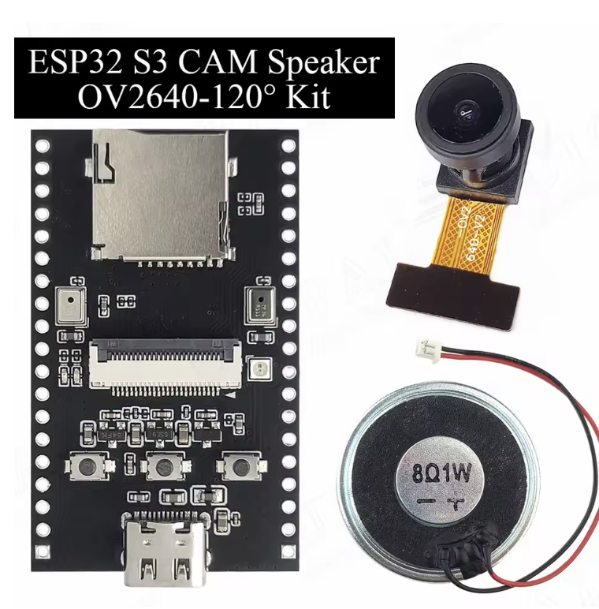

# ESP32-S3 Camera module projects

> [!WARNING]
> **AI-Powered Project Disclaimer**
>
> This project was developed with AI assistance. The code is provided "as is" without warranty. The author assumes no responsibility for any damage, data loss, or hardware failure.
>
> **Use at your own risk!** Test thoroughly before deploying.

* [Docs](ESP32_s3_CAM_DOCs)
* [Movement detection](movement-detection)
* [Web camera with audio](web-cam-esp32-s3)
* [SD card test](sd-card-test-spi)
